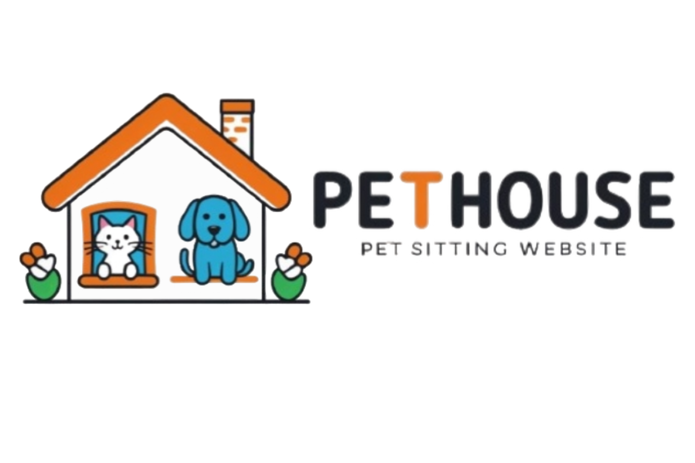

# PetHouse



## Contenuti

## Cos'è PetHouse

PetHouse è un’applicazione web progettata per l’esame di Programmazione per il Web del corso triennale di Ingegneria Informatica dell’Università degli Studi dell’Aquila.
L’applicazione utilizza il pattern MVC (Model-View-Controller) e si serve di PHP e Smarty.

## Funzioni Principali

PetHouse permette di mettere in contatto proprietari di casa che mettono a disposizione il loro tempo e spazio per ospitare animali di compagnia,
con chi ha necessità di lasciare il proprio animale per alcuni giorni.

L' applicazione permette di:
  -  Creare un accout e fare login.
  -  Cercare un post con filtri come città e animamli richiesti.
  -  Offrire disponibilità per ospitare uno o più animali da compagia.
  -  Lasciare recensioni.
  -  Gestire richieste di prenotazioni.
  -  L' admin gestisce reclami riguardanti i post.
  -  L' admin assegna il verificato ad utenti che ne fanno richiesta.

  


## Requisiti

### Per l’installazione su server locali

- **XAMPP** (inclusi PHP e phpMyAdmin)  
  [Scarica XAMPP](https://www.apachefriends.org/index.html)
- **Composer**  
  [Scarica Composer](https://getcomposer.org/)

---

## Guida all’installazione

1. **Scarica la cartella del progetto** (via git o zip).
2. **Sposta la cartella** nella directory `htdocs/` di XAMPP:
   ```
   C:\xampp\htdocs\PetHouse
   ```
3. **Apri il terminale** nella cartella dell’applicazione e lancia:
   ```bash
   composer install
   ```
4. **Configura il database**  
   Modifica `config/config.php` secondo le impostazioni del tuo XAMPP/MySQL.
5. **Crea il database**  
   Esegui il file `create_schema.php` (gestito dall'ORM Doctrine).
6. **Abilita la riscrittura URL in Apache**
   - Apri il file `httpd.conf` di Apache.
   - Assicurati che la riga:
     ```
     LoadModule rewrite_module modules/mod_rewrite.so
     ```
     **non** abbia `#` all’inizio.
   - Verifica che sia presente:
     ```
     AllowOverride All
     ```
7. **Avvia XAMPP**  
   Attiva **Apache** e **MySQL**.
8. **Avvia l’applicazione**  
   Apri il browser e vai su:
   ```
   http://localhost/PetHouse
   ```

---

### Nota per utenti Linux

Per far funzionare l’applicazione, **abilita i permessi di lettura, scrittura ed esecuzione** su tutti i file del progetto.  
Esegui nel terminale:
```bash
chmod -R a+rwe /percorso-alla-cartella-PetHouse
```
Assicurati che anche la cartella `smarty/libs/templates_c` abbia i permessi corretti.

---

## Autori

- [@Samuele233](https://github.com/Samuele233)
- [@Frozzo](https://github.com/Frozzo)
- [@rarats13](https://github.com/rarats13)
